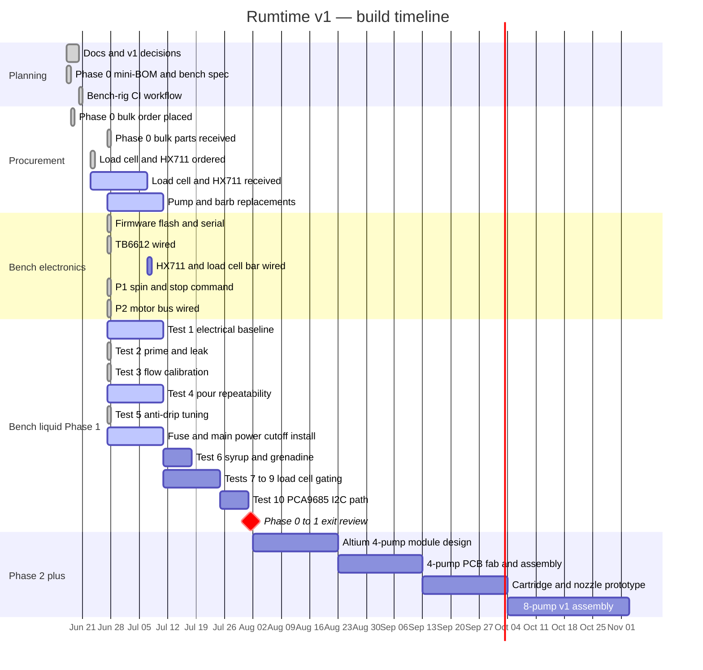

# Project Timeline

Living Gantt and procurement log for Rumtime v1. Update after bench sessions, orders, and phase gates.

Reference: [`09-build-plan-and-verification.md`](09-build-plan-and-verification.md), [`14-bench-test-protocol.md`](14-bench-test-protocol.md).

**Last updated:** 2026-06-27 (returns: 2× 24 V pumps shipped; smooth couplers **not yet returned** — see procurement notes).

## Gantt chart

**Legend:** `done` = verified in repo or bench log; `active` = started, not complete; unmarked future bars = planned (dates are estimates until Phase 1 exit).

## Milestones

| Date       | Milestone                                      | Evidence |
| ---------- | ---------------------------------------------- | -------- |
| 2026-06-17 | Project repo and v1 hardware docs              | Initial commit |
| 2026-06-17 | Phase 0 decisions locked (KPHM100, TB6612, S3) | `12-phase-0-decisions.md` |
| 2026-06-17 | Bench-rig firmware tree added                  | `firmware/bench-rig/` |
| 2026-06-18 | Phase 0 bulk parts ordered (mini-BOM)          | Operator |
| 2026-06-20 | Bench-rig CI (PlatformIO build)                | `.github/workflows/` |
| 2026-06-23 | Load cell bar + HX711 ordered (same shipment)  | Operator |
| 2026-06-27 | Phase 0 bulk parts received (scale kit pending) | Operator |
| 2026-06-27 | Session 01 — TB6612 + P1 bring-up (no scale yet) | `bench-results/2026-06-27-session-01.md` |
| 2026-06-27 | Session 02 — P1+P2 @ 1.75 ml/s, anti-drip 100 ms | `bench-results/2026-06-27-session-02.md` |
| 2026-06-27 | 2× 24 V pumps returned; smooth couplers return **pending** (1.8 mm ID, on hand) | Operator |
| TBD        | Tests 7–9 pass (load cell + flow-gate)         | — |
| TBD        | Test 10 pass (PCA9685 I2C)                      | — |
| TBD        | Phase 0–1 exit → order 4-pump PCB              | `14-bench-test-protocol.md` exit checklist |
| TBD        | First drink from 8-pump v1                     | Phase 4 exit |

## Bench session log (timeline)

| Date       | Session | Focus |
| ---------- | ------- | ----- |
| 2026-06-27 | 01      | Firmware, TB6612, P1 dry spin (scale not wired) |
| 2026-06-27 | 02      | Water prime, flow cal, P2, anti-drip, Test 4b partial |

## Procurement log

Fill **ordered** and **received** as you go. Sourced from [`13-phase-0-mini-bom.md`](13-phase-0-mini-bom.md).

| Item | Qty ordered | Received | Status | Notes |
| ---- | ----------: | -------- | ------ | ----- |
| KPHM100-HB-B10 pump (12 V) | 4 | 2026-06-27 | **2 kept / 2 returned** | Seller shipped **2× 24 V** variants; returned. **P1+P2** on bench are correct 12 V HB. Spare pumps pending replacement. |
| Pololu TB6612FNG #713 | 4 | 2026-06-27 | OK | **1** on bench (P1+P2); **3** spare — enough for 4-pump bench / Test 10 without reorder |
| ESP32-S3-DevKitC-1 | 1 | 2026-06-27 | OK | N16R8 on bench; 8 MB flash profile |
| Mean Well GST60A12-P1J (12 V 5 A) | 1 | 2026-06-27 | OK | Interim: bench DC supply also in use |
| 3×5 mm FDA silicone tubing | 2 rolls × 5 m | 2026-06-27 | OK | **10 m** total; 3×5 mm class (caliper waived — fit OK on bench) |
| PP barb unions (Quickun B08L5DTRCK class) | 1 set | 2026-06-27 | **Wrong SKU — return pending** | Shipped as **smooth silicone couplers** (slip join, not barbed). **Not yet returned** (post office pending). Operator measured **1.8 mm ID** bore vs **3 mm** line tubing. **Not** a barb union; on outlet (tube in one end, pour from other) narrows orifice vs open 3 mm tube. Food-contact rating not verified. Sessions 01–02 used **open ~3 mm outlet** (no restriction at tip). |
| Spring clamps | 1 set | 2026-06-27 | OK | |
| Inline fuse + main power cutoff | 1 | 2026-06-27 | OK | Not installed yet |
| Estardyn 5 kg load cell bar + HX711 | 1 set | — | **Pending** | Ordered **2026-06-23**; bundled kit **ships together** — not in hand as of 2026-06-27; blocks Tests 7–9 |
| Graduated cylinder (250 ml) | 1 | 2026-06-27 | OK | In use session 02 |
| Breadboard + jumpers | 1 | 2026-06-27 | OK | |
| PCA9685 breakout | 1 | — | — | Buy after liquid tests (Test 10) |

**Order dates:** Bulk mini-BOM **2026-06-18** (delivered **2026-06-27**). Load cell bar + HX711 **2026-06-23** — separate shipment, still in transit.

### Open replacements

| Item | Need | Action |
| ---- | ---- | ------ |
| KPHM100 **12 V HB** pump | 2 (spare + P3 variance) | Await refund/replacement after 24 V return; **verify motor label before bench** |
| Smooth silicone couplers (wrong SKU) | 1 set | **Return pending** — post office not yet; Amazon return for barb-union mis-ship |
| **Barbed** 1/8" PP unions (3×5 mm line) | 1 set | Re-order after return/refund; confirm barbs in product photos/reviews (not smooth silicone couplers) |

### Future orders (not Phase 0)

| Item | Target phase | Ordered | Received |
| ---- | ------------ | ------- | -------- |
| 4-pump Altium module PCB | 2 | — | — |
| GST120A12-R7B (8-pump PSU) | 4 | — | — |
| Second 4-pump module | 4 | — | — |

## How to update

1. After each bench session — add a row to **Bench session log**; shift or mark Gantt tasks `done` / `active`.
2. When you order or receive parts — fill **Procurement log** dates.
3. When a phase gate passes — add a **Milestones** row and adjust Phase 2+ bar start dates.
4. Optional — open the live canvas: [`rumtime-timeline.canvas.tsx`](/Users/chris2fourlaw/.cursor/projects/Volumes-Workspace-GitHub-Rumtime/canvases/rumtime-timeline.canvas.tsx) (mirrors this file; edit the markdown as source of truth).
